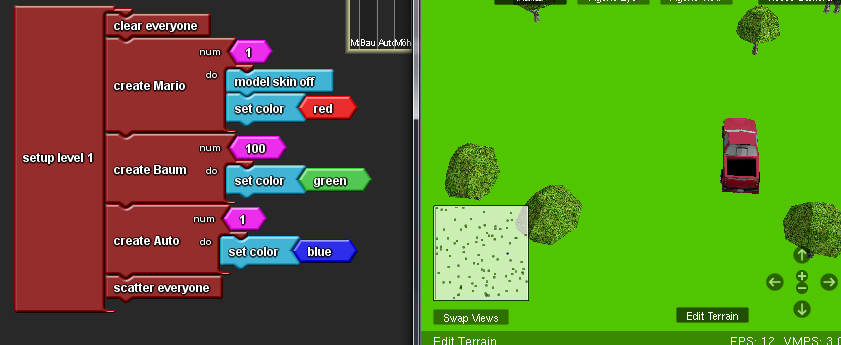
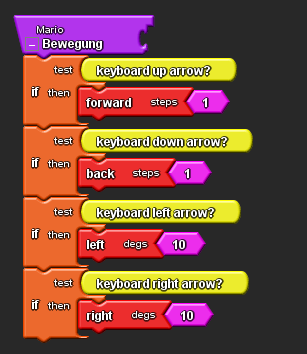
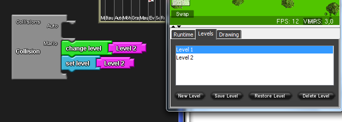

# Adventure-Spiel

Nachdem wir uns in unserem ersten Halbjahr gut in das Programm Star Logo TNG eingearbeitet hatten, entschlossen wir uns auch bei unserem  nächsten Projekt dieses Programm zu verwenden. 
Unser Ziel ist es ein Adventure Spiel mit verschiedenen Levels zu programmieren, in denen der Agent verschiedene Aufgaben, die mit der Höhe des Levels immer schwerer werden, bewältigen muss.

[Dritte Stunde](#drei)

[Zweite Stunde](#zwei)

[Erste Stunde](#eins)

## Dritte Stunde

Nachdem wir in der letzten Stunde festgestellt haben, dass unsere Programmierung nicht so funktioniert, wie wir uns das vorgestellte hatten, haben wir uns für diese Stunde vorgenommen, diesen Fehler zu beheben. Das Problem war, dass Mario zwar in das zweite Level springt, dieses aber nicht so erscheint, wie wir es vorher programmiert hatten. Denn wir hatten zuvor in einen zweiten "setup"-Block Agentenblöcke eingesetzt, um dann in dem zweiten Level weitere Gegenstände in dem Spaceland zu haben. Diese tauchten allerdings nicht auf wenn Mario in das zweite Level sprang, sondern sie entstanden erst dann wenn man den "setup"-Block für das zweite Level anklickte. Dann jedoch verschwand Mario. 
Nach etlichen gescheiterten Versuchen, wie man dies anders programmieren könnte, fragten wir schließlich Herrn Buhl um Hilfe. Da aber auch er sich bei der Programmierung von verschiedenen Leveln nicht ganz sicher war, 

## Zweite Stunde

Unser heutiger Plan war, das zweite Level zu bearbeiten. In diesem soll Mario nun einen, noch undefinierten, Gegenstand einsammeln und danach durch ein Tor in einer Mauer gehen um dann in das dritte Level zu gelangen.
Uns ist es wichtig, dass der Spieler mit jedem neuen Level eine neue Welt betritt. Deshalb haben wir begonnen das Terrain im zweiten Level zu verändern. Wir wollten das komplette Spaceland bräunlich einfärben, damit eine Art Savannen oder Wüsten Landschaft entsteht. Dazu haben wir mit HIlfe der Drawing-Funktion, welche in dem Spacelandfenster zu finden ist, unsere Wunschfarbe gemischt und damit den Boden des Spacelandes eingefärbt. Außerdem haben wir einen Teil des Spacelandes abgesenkt, sodass eine Art Schlucht entsteht.
Als nächstes haben wir eine Mauer mit einem "setup"-Block eingefügt. Allerdings wollten wir, dass die Mauer ganz am Rand des Spacelands, und nicht in der Mitte, steht. Da das Spaceland sich in einem Koordinatensystem befindet, welches nicht sichtbar ist, allerdings zur STandortfestlegung herangezogen werden kann, konnten wir dies durch spezielle Blöcke erreichen. In diesen setzten wir dann die erwünschten Standortkoordinaten der Mauer ein. So stand die Mauer am Ende genau da, wo sie sein sollte.
Unser Spaceland war allerdings noch ziemlich trist und langweilig, weshalb wir uns dazu entschlossen haben Gras einzufügen. Wie auch schon zuvor die Mauer, haben wir das Gras mit Hilfe des "setup"-Blocks kreiert und es durch einen "change colour"-Block orange eingefärbt. 
Am Ende dieser Stunde waen wir recht zufrieden mit der "Welt" des zweiten Levels, doch so einfach wie gedacht hatten funktionierte das Erstellen eines neuen Levels doch nicht, wie wir in der nächsten Stunde feststellen mussten...

## Erste Informatikstunde

In der ersten Stunde haben wir die Basis für unser Spiel geschaffen, indem wir einen Agenten programmierten und das Terrain bearbeiteten. Wir erschufen Bäume und ein Auto, zu welchem der Agent gelangen muss um in das nächste Level (Level 2) aufzusteigen.  
Damit man die verschiedenen Gegenstände auf der Karte besser erkennen kann, haben wir die Bäume grün und das Auto blau eingefärbt. Allerdings verfärben sich nur die Punkte auf der Karte und nicht die Objekte selber, da sie eine "Haut" tragen. Als unseren Agenten wählten wir Mario, dessen Haut wir entfernten und ihn darauf rot einfärbten, um ihn in dem Spaceland besser erkennen zu können. Dies konnten wir mit Hilfe eines "model skin off"-Blockes verwirklichen.

Um unseren Arbeitsplatz bei Star Logo TNG übersichtlich und organisiert aufzubauen, programmierten wir die Steuerung von Mario in einem Block. Dazu verwendeten wir den "procedure"-Block und nannten ihn Bewegung. An diesen hängten wir mehrer "if"-Blöcke um die Bedingungen für die Steuerung festzulegen. Es muss also zum Beispiel die Pfeiltaste nach oben gedrückt werden, um Mario vorwärts laufen zu lassen. 

 
Das Ziel des ersten Levels ist es die "Tür" in das zweite Level zu finden. Die "Tür" ist in unserem Fall das Auto, wenn Mario mit diesem kollidiert, gelangt er automatisch in das zweite Level. Dafür benutzten wir "change level"- und "set level"-Blöcke. Der "change level"-Block sorgt dafür, dass der Spieler das zweite Level sieht, sich also das Terrain verändert, während der "set level"-Block sicherstellt, dass der Agent weiß, dass er sich in dem zweiten Level befindet.
 

